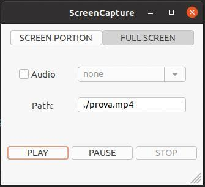

# Screen-capture

## Our Team 
* [Sofia Catalano](https://github.com/sofia-catalano)
* [Alessio Dongiovanni](https://github.com/alessiodongio)
* [Davide Leone](https://github.com/davide-leone96)

## Our Project
Screen-capture is a system based on two components:
* The **Screen-capture library**, a multiplatform C++ library capable of capturing the entire screen, or a portion of it, and storing it in mp4 format, with or without audio recorded by the microphone.
* The **wxWidgets application**, a C++ frontend based on wxWidgets libraries, used to show the proper behavior of the Screen-capture library, and to allow the user to record/pause/resume/stop a video stream.

### Screen-capture library
#### Characteristics 
This is the main part of the project. This library is composed by 2 main files:
* ScreenRecorder.ccp
* ScreenRecorder.h

It uses a third part library, **ffmpeg**. In particular: avformat, avutil, avcodec, avdevice, swscale, swresample.
These libraries allow us to capture audio and video frames, to elaborate them and save the final media in a mp4 file. 

#### Features
The feature available in the Screen-capture library are: 
* Record **Screen Video**
* Eventually record **Audio**
* **Activate and stop** the recording process
* Temporarily **pause** and subsequently **resume** the recording process
* Define the **area** to be recorded
* Define the **file .mp4** that will contain the final recording
* In case of **internal errors**:
  * throws an exception with a description of the error
  * stops the recording process, if it has been activate
  * save in the .mp4 file what has been recorded untill that moment
  * deallocate the resources allocated untill that moment

#### Functions
The functions implemented in the Screen-capture library are: 
* **initializeOutputContext()**: allocates the resources for the final .mp4 file.
* **initializeVideoResources()**: invokes all the required methods (below) in order to initialize all the video resources
  * initializeVideoInput()
  * initializeVideoOutput()
  * initializeVideoCapture()
* **initializeAudioResources()**: invokes all the required methods (below) in order to initialize all the audio resources
  * initializeAudioInput()
  * initializeAudioOutput()
* **initializeOutputMedia()**: creates the empty video .mp4 file and adds header information
* **recording()**: manages all the phases of the recording process, and the operations of play/resume. In particular it activates 2 different threads for capturing the audio and video streams. 
  * The first thread executes the function **convert_video_format()**. It gets the input video frames from the os virtual device (*x11grab* on Linux, *gdigrab* on Windows and *avFoundation* on macOS), decode and encode them in the new format and write them in the output file. It also performs scaling.
  * The second thread executes the function **convert_audio_format()**. It gets the input audio frames from the os virtual device (*alsa* on Linux, *dshow* on Windows and *avFoundation* on macOS), decode and encode them in the new format and write them in the output file.
* **pause()**: allows to pause the recording process
* **stop_recording()** allows to stop the recording process
 
### wxWidgets application
Allow to use the Screen-Capture library, offering a GUI to give commands.
In particular it allows the user to
* define the area to be recorded
* select whether the audio should be captured or not
* activate and stop the recording process
* pause and subsequently resume it
* define the file that will contain the final recording

It uses the function **getAudioDevices()** (in Devices.cpp) to get the available input audio devices on Windows and Linux.  

#### Screenshot

The application works with Linux and Windows, but it has not been tested on MacOS.

## How to run compile and run

### Linux
#### wxWidgets application
1. Execute these commands from the terminal: 
   * sudo apt install libgtk-3-dev
   * git clone --recurse-submodules https://github.com/wxWidgets/wxWidgets.git
   * cd wxWidgets
   * mkdir buildgtk
   * cd buildgtk
   * ../configure --with-gtk
   * make
   * sudo make install
   * sudo ldconfig

#### Screen-recorder library
1. Execute these commands from the terminal: 
   * sudo apt install libavcodec-dev libavdevice-dev libavfilter-dev libavformat-dev libavutil-dev libsdl-dev
2. Open this file /etc/ld.so.conf
3. Add these lines at the end of the file: 
   * include /etc/ld.so.conf.d/*.conf
   * /usr/local/lib
4. Execute this command from the terminal:
   * sudo /sbin/ldconfig -v

5. Check if X11 lib is installed with this command from the terminal: 
   * xdpyinfo | grep version
6. If it is not installed execute this command from the terminal: 
   * sudo apt install libx11-dev

### Windows
#### wxWidgets application
1. Download windows binaries mingGW-w64 7.3 from https://www.wxwidgets.org/downloads/  (choose the version according to the compiler)
2. Execute these commands from the terminal: 
   * mkdir wx-3.1
   * cd wx-3.1
3. Unzip here the 3 files, you should have 3 folders
4. Go to environment variables
5. Add to path ..\wx-3.1\wxMSW-3.1.5_gcc730_x64_Dev\lib\gcc730_x64_dll
6. Restart the pc

#### Screen-recorder library
1. Download ffmpeg library as a zip from https://github.com/FFmpeg/FFmpeg/tree/master
2. Unzip and extract the folder *FFmpeg-master*
3. Download windows binaries mingGW-w64 from https://sourceforge.net/projects/mingw-w64/
4. Download Msys from https://www.msys2.org/
5. Go to environment variables
6. Add to path
   * C:\msys64\usr\local\bin
   * C:\msys64\mingw64\bin
7. Open *MSYS2 MinGW 64-bit* shell and execute these commands:
   * pacman -S make pkgconf diffutils
   * pacman -S mingw-w64-x86_64-nasm mingw-w64-x86_64-gcc mingw-w64-x86_64-SDL2
     * In case of errors or packets not found execute the command *pacman -Syu* and re-execute the commands above
8. Restart the pc
9. Open *MSYS2 MinGW 64-bit* shell and execute these commands:
   * cd FFmpeg-master
   * ./configure –enable-shared
   * make
   * make install

### MacOS

#### Screen-recorder library
1. Execute these commands from the terminal:
   * brew install ffmpeg
   * brew update && brew upgrade ffmpeg
2. Download and install X11 lib from this link: 
   * https://github.com/XQuartz/XQuartz/releases/download/XQuartz-2.8.1/XQuartz-2.8.1.dmg
